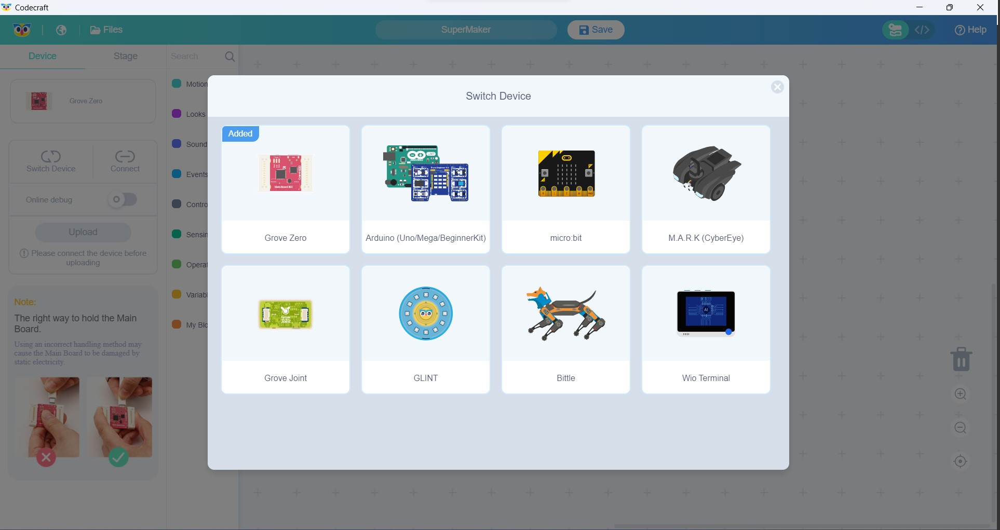

# Codecraft

[](https://www.yuque.com/tinkergen-help-en/codecraft?language=en-us)

**Codecraft is a graphical programming software which is based on [Scratch 3.0](https://scratch.mit.edu/). It targets teenagers of age 7-16, compatible with WIN/MAC.**  
By using a drag-and-drop interface, Codecraft has been helping users program without the need to write code in traditional text-based programming languages. Since its’ launch in 2018, it’s designed to make it easier for beginners, especially STEAM classrooms, to embrace coding to create projects and prototypes. With a focus on programming microcontrollers and IoT devices, Codecraft has been adapted and trusted by thousands of users all around the world. In 2022, Codecraft was recognized as [Bett Awards Finalist](https://www.seeedstudio.com/blog/2022/04/06/seeed-studio-codecraft-recognized-finalist-by-edtech-awards-2022/) and [The Edtech Awards Cool Tool Finalist](https://www.seeedstudio.com/blog/2022/04/06/seeed-studio-codecraft-recognized-finalist-by-edtech-awards-2022/), two important and in prestigious awards the education technology industry. 

[Codecraft help online](https://www.yuque.com/tinkergen-help-en/codecraft?language=en-us)

### Support Devices

- [Grove Zero](https://www.seeedstudio.com/Grove-Zero-Starter-Kit-V2-0-p-4352.html)

- [Arduino Mega](https://www.seeedstudio.com/Arduino-Mega2560-Rev3-p-695.html?queryID=4ca214ec6d1c29f11b4fb8ea9b412462&objectID=1868&indexName=bazaar_retailer_products) && [Arduino Uno](https://www.seeedstudio.com/Arduino-Uno-Rev3-p-2995.html?queryID=62ec7ca39b8fe0ebc6e04c773397de71&objectID=196&indexName=bazaar_retailer_products) && [Grove Beginner Kit for Arduinol](https://www.seeedstudio.com/Grove-Beginner-Kit-for-Arduino-p-4549.html)

- [micro:bit](https://www.seeedstudio.com/MICRO-BIT-SBC-BOARD-ONLY-V2-2-p-5294.html?queryID=aa6734c4d3222d27c9fe62e74012ccd3&objectID=5294&indexName=bazaar_retailer_products)

- [M.A.R.K(CyberEye)](https://www.seeedstudio.com/Make-A-Robot-Kit-p-4669.html?queryID=fd7dc3b439a2a85852f4f46efe8bbd2b&objectID=4669&indexName=bazaar_retailer_products)

- [GLINT](https://www.seeedstudio.com/Glint-Programmable-Wearable-Bracelet-p-4631.html?queryID=2638256e766bc26fe3165286a556f669&objectID=4631&indexName=bazaar_retailer_products)

- [Bittle](https://www.seeedstudio.com/CH-Bittle-p-4833.html?queryID=fe0d39474704586c27934023f1a5b95a&objectID=4833&indexName=bazaar_retailer_products)

- [Wio Terminal](https://www.seeedstudio.com/Wio-Terminal-p-4509.html?queryID=86e04846e7077e38bdc4182aeba96330&objectID=4509&indexName=bazaar_retailer_products)

## Download

You can download the latest version from [the download page from our website](https://ide.tinkergen.com/download/en/) or [Github Release](https://github.com/Seeed-Studio/CodeCraft/releases)

## Prerequisites

This project requires:
- [Node.js 16+](https://nodejs.org/)
- [Python 2.x](https://www.python.org/downloads/release/python-272/), or [Python 3.x](https://www.python.org/downloads/) and make it as the default version

### Auto Install

Linux/Mac:

```bash
bash run-mac.sh
```

Windows:

```bash
bash run-win64.sh
```

### Manual Installation

```bash
cd ./blocks
npm install && npm run build

cd ./l10n
npm install && npm run build

cd ./vm
npm install && npm run build

cd ./gui
npm install
```

- For mac or linux like

```bash
npm run build-mac
```

- For win

```bash
npm run build-win
```

#### Build main app

```bash
rm -r ../main/app/gui && cp -r ./build ../main/app/gui
cd ./main/app
npm install
./node_modules/.bin/electron-rebuild serialport

# If the error message “script is prohibited on this system” appears on the Windows   
# system, you need to open powershell as an administrator, and then execute 
# Set-ExecutionPolicy RemoteSigned

cd ./main
npm install
rm -r build 
```

- For Mac

```bash
npm run publish-mac
```

- For Linux like

```bash
npm run publish-linux
```

- For Windows

```bash
npm run publish-win64
```

Once you finish building, you can find the installer under main/build/

## Contribute

`PR welcome`

Here, we’d also love to announce an open call for contributions to Codecraft open source project on GitHub. Whether you're a seasoned programmer or just starting out, we welcome contributions of all levels. From fixing bugs, to implementing new features & new blocks of functions, to make it compatible with more hardware platforms, to improving the overall codebase, there are many ways in which you can contribute to the project. Thanks in advance for your interest in [contributing](./misc/CONTRIBUTING.md) to this project!

## License

The code contained in this repository and the executable distributions are licensed under the terms of the Apache License 2.0. The executable distributions contain third-party code licensed under other compatible licenses such as BSD-3.
